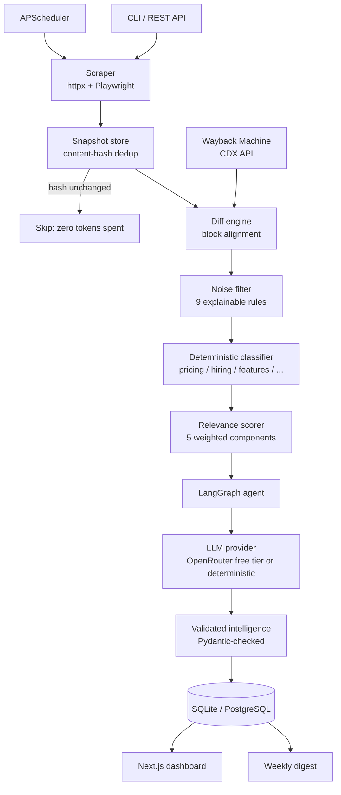
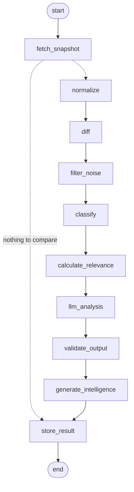

# RivalRadar

**An AI competitor-tracking agent that turns raw website diffs into ranked, explained competitive intelligence.**

---

## The problem

Founders find out about competitor moves too late — a price rise, a new AI feature, a hiring spree that signals where a rival is investing. The obvious fix is to diff competitor pages on a schedule, but a naive differ is useless: a typical page comparison produces well over a hundred "changes", almost all of which are rotating session IDs, copyright years, cookie banners, visitor counters and cache-busted asset hashes.

The hard part is not detecting change. It is **deciding which changes matter.**

RivalRadar is built around that filter:

```
147 HTML changes detected          ← what a naive differ gives you

                ↓

Competitor A — Important Pricing Change
Pro plan increased from ₹999/month → ₹1,499/month.
Impact: Potential pricing repositioning toward enterprise customers.
Confidence: 96%                    ← what RivalRadar gives you
```

Every stage of that reduction is counted, attributed to a named rule, and stored — so the headline metric is auditable rather than asserted.

---

## Architecture



### The LangGraph pipeline

The intelligence pipeline is a compiled LangGraph state machine (`app/agents/graph.py`). Print it any time with `rivalradar graph`:



The conditional edge out of `fetch_snapshot` is the cost control: when a page's content hash is unchanged, the graph jumps straight to the end and spends zero tokens.

`validate_output` is the gate before anything is written: every model response is re-validated with Pydantic, anything the model marked `is_meaningful: false` is dropped, and any before/after value that is **not grounded in the observed diff** is rejected as invented.

---

## The core idea: raw changes → meaningful intelligence

Three design decisions make the noise-reduction number mean something.

**1. Noise is counted, not hidden.**
Block alignment uses *canonicalised* keys (dynamic tokens masked), which is robust. But blocks that align yet differ in visible text — `Copyright 2025` vs `Copyright 2026` — are still emitted as raw changes and then rejected by the filter. Skipping them silently would have inflated the metric by quietly shrinking the denominator.

**2. Every rejection is attributed.**
The nine rules run cheapest-first and each returns a human-readable reason, stored on the row:

| Rule | Rejects |
|---|---|
| `identical` | Differs only in whitespace, casing or dynamic tokens |
| `empty` | Nothing of substance on either side |
| `url_only` | Link target moved, visible copy unchanged |
| `counter_churn` | Live counters, "Trusted by 4,200 developers" |
| `numeric_only` | Bare numbers with no surrounding meaning |
| `boilerplate_location` | Nav, footer, cookie banner, ad slots |
| `chrome_copy` | Consent text, legal links, social widgets |
| `price_unchanged` | Pricing block reworded, amounts unmoved |
| `low_magnitude` | Edits below the magnitude threshold |

A **strong-signal override** rescues real content from generic rules: a price change inside a footer survives the boilerplate rule, because a price is a price wherever it appears.

**3. The LLM does not get to score.**
The relevance score is deterministic and transparent:

```
relevance = 0.30 × business_impact
          + 0.20 × customer_impact
          + 0.20 × strategic_significance
          + 0.15 × change_magnitude
          + 0.15 × classifier_confidence
```

scaled to 0–100 and banded: `0–29 noise · 30–49 low · 50–69 medium · 70–84 high · 85–100 critical`.

The LLM may adjust that score by **at most ±12 points** (`blend_with_llm_score`). It handles interpretation — what a move means commercially — not detection and not ranking. A model that returns `relevance_score: 100` for everything cannot distort the dashboard.

---

## Features

- **Competitor management** — track whole domains or specific pages (pricing, careers, integrations); enable/disable, edit, delete, scan on demand.
- **Defensive scraping** — SSRF-validated URLs (every redirect hop re-checked), robots.txt awareness, per-origin delays, exponential-backoff retries, size caps, a clear User-Agent. Optional Playwright rendering for JS-heavy sites.
- **Snapshot deduplication** — identical content hashes are never stored twice and never reach the LLM.
- **Structural diff engine** — block-level alignment with greedy replacement pairing, so an edited paragraph reads as one before/after pair instead of an unrelated delete plus insert.
- **Hybrid classification** — deterministic detectors for pricing (multi-currency: `$`, `€`, `£`, `¥`, `₹`, and word forms like `Rs 999`), features, product, hiring, integrations and messaging, each emitting numeric signals the scorer consumes.
- **Validated LLM output** — every response parsed through Pydantic with aggressive coercion (0–1 scores, `"91%"` strings, `"high"`, fenced JSON, trailing commas). Anything unusable falls back deterministically.
- **Free-tier LLM by default** — OpenRouter's OpenAI-compatible API. No paid provider is required anywhere.
- **Runs without an API key** — with no key the deterministic provider renders analysis from the signals the classifier already extracted, and the UI says `Analyst: deterministic`. It never claims AI ran when it did not, and never invents a fact absent from the diff.
- **Weekly digest** — a briefing with the measured funnel attached.
- **Wayback evaluation** — benchmark the pipeline against real archived pages.
- **Dashboard** — funnel visualisation, competitor timelines, word-level before/after diffs, analytics, and a UI to run evaluations.

---

## Tech stack

| Layer | Choice |
|---|---|
| API | FastAPI + Uvicorn |
| Agent | LangGraph |
| Validation | Pydantic v2 + pydantic-settings |
| ORM | SQLAlchemy 2.0 |
| Database | SQLite (PostgreSQL by changing `DATABASE_URL`) |
| Scraping | httpx + BeautifulSoup + lxml, Playwright optional |
| LLM | OpenRouter (free tier), behind a provider abstraction |
| Scheduling | APScheduler |
| CLI | Typer + Rich |
| Frontend | Next.js 15 (App Router), TypeScript, Tailwind CSS v4 |
| Tests | pytest |

---

## Project structure

```
rivalradar/
├── backend/
│   ├── app/
│   │   ├── agents/          LangGraph state, nodes and graph
│   │   ├── api/             FastAPI routes and error handlers
│   │   ├── config/          Settings and logging
│   │   ├── database/        Engine, session, seeding, demo pages
│   │   ├── diff/            Diff engine, noise filter, value objects
│   │   ├── evaluation/      Wayback benchmark + CLI entry point
│   │   ├── intelligence/    Classifier, relevance scorer, analyzer, digest
│   │   ├── llm/             Provider abstraction (OpenRouter + deterministic + OpenAI)
│   │   ├── models/          SQLAlchemy entities
│   │   ├── schemas/         API and LLM contracts
│   │   ├── scheduler/       APScheduler jobs
│   │   ├── scrapers/        Fetcher, normalizer, robots, SSRF guard
│   │   ├── services/        Scan orchestration, snapshots, analytics, wayback
│   │   ├── cli.py           rivalradar CLI
│   │   └── main.py          FastAPI app
│   ├── tests/               310 tests
│   ├── requirements.txt
│   └── .env.example
├── frontend/
│   ├── app/                 Dashboard, competitors, changes, analytics, digest, evaluation
│   ├── components/          Funnel, charts, change rows, dialogs, UI primitives
│   ├── lib/                 Typed API client, formatting, types
│   └── hooks/               Data-fetching hooks
├── data/
│   ├── snapshots/           Stored page bodies
│   └── reports/             Evaluation reports (text + JSON)
├── scripts/                 setup.sh, run_demo.sh, evaluate.sh (macOS/Linux)
├── setup.ps1                Windows one-time setup
├── start-backend.ps1        Windows: run the API
├── start-frontend.ps1       Windows: run the dashboard
├── docker-compose.yml       Optional, untested — not needed locally
├── EVALUATION.md            Measured benchmark results
└── README.md
```

---

## Setup (Windows)

**Requirements:** Python 3.11+ and Node 18+ on your PATH. **Docker is not required.**

From the project root in PowerShell:

```powershell
.\setup.ps1
```

That creates the backend virtual environment, installs both dependency sets, writes `.env` files from the examples, creates the SQLite database, loads demo data and generates a first digest.

<details>
<summary>Manual setup, if you prefer</summary>

```powershell
# Backend
cd backend
python -m venv .venv
.venv\Scripts\activate
pip install -r requirements.txt
pip install -e .
copy .env.example .env
rivalradar init
rivalradar seed

# Frontend
cd ..\frontend
npm install
copy .env.example .env.local
```

</details>

On macOS/Linux the equivalent is `bash scripts/setup.sh`.

---

## Running locally

Two terminals:

```powershell
# Terminal 1 — API on http://localhost:8000
.\start-backend.ps1
```

```powershell
# Terminal 2 — dashboard on http://localhost:3000
.\start-frontend.ps1
```

<details>
<summary>Or run the commands directly</summary>

```powershell
# Terminal 1
cd backend
.venv\Scripts\activate
uvicorn app.main:app --reload

# Terminal 2
cd frontend
npm run dev
```

</details>

Then open:

| | |
|---|---|
| **Dashboard** | http://localhost:3000 |
| **API docs (Swagger)** | http://localhost:8000/docs |
| **API root** | http://localhost:8000 |

Docker is optional and not part of the normal workflow. A `docker-compose.yml` is included for deployment, but it is **not tested** and nothing in local development depends on it.

---

## Environment variables

**Nothing is required to run.** Both `.env` files are created from their examples during setup, and every value has a working default.

### Backend — `backend/.env`

| Variable | Default | Purpose |
|---|---|---|
| `DEMO_MODE` | `false` | `false` = real competitor tracking only; the database starts empty. `true` lets `rivalradar seed` load fictional sample companies, labelled DEMO in the UI. |
| `LLM_PROVIDER` | `openrouter` | `openrouter` \| `deterministic` \| `openai` \| `auto`. |
| `OPENROUTER_API_KEY` | *(empty)* | **The only value you need to add.** Free key from [openrouter.ai/keys](https://openrouter.ai/keys). Empty → deterministic analysis, honestly labelled. |
| `OPENROUTER_MODEL` | `openrouter/free` | Free model slug. See the note below. |
| `OPENROUTER_BASE_URL` | `https://openrouter.ai/api/v1` | OpenAI-compatible endpoint. |
| `LLM_MAX_CALLS_PER_SCAN` | `8` | Hard ceiling on model requests per scan. |
| `LLM_MIN_RELEVANCE` | `40` | Candidates below this score never reach the model. |
| `OPENAI_API_KEY` | *(empty)* | Optional, **paid**, not required by anything. |
| `DATABASE_URL` | *(unset)* | Leave unset: defaults to an absolute path at `backend/rivalradar.db` so the same DB is used from any working directory. Set a PostgreSQL URL to switch databases with no code change. |
| `SCAN_USER_AGENT` | `RivalRadar/1.0 (…)` | Identifies the crawler to sites it visits. |
| `REQUEST_DELAY_SECONDS` | `1.5` | Minimum delay between requests to one origin. |
| `RESPECT_ROBOTS_TXT` | `true` | Honour `Disallow` and `Crawl-delay`. |
| `ALLOW_PRIVATE_NETWORKS` | `false` | SSRF guard — keep `false`. |
| `PLAYWRIGHT_ENABLED` | `false` | JavaScript rendering (needs the optional install). |
| `SCHEDULER_ENABLED` | `false` | Background scheduled scans. |
| `CORS_ORIGINS` | `http://localhost:3000,…` | Only needed if the browser calls the API directly. |

### Frontend — `frontend/.env.local`

| Variable | Default | Purpose |
|---|---|---|
| `BACKEND_URL` | `http://127.0.0.1:8000` | Where Next.js proxies `/api/*` **server-side**. The browser always calls same-origin `/api/...`, so there is no CORS and no backend host in the JS bundle. |
| `NEXT_PUBLIC_API_URL` | *(unset)* | Optional escape hatch to make the **browser** call the backend directly. Leave unset for local use; if set, add that origin to `CORS_ORIGINS`. |

Secrets only ever come from the environment. `.env` and `.env.local` are gitignored; only the `.env.example` files are committed. **The API key lives only in `backend/.env`** — it is never in source, never in the frontend bundle, and never returned by the API.

---

## Enabling AI analysis (free)

RivalRadar works with no API key at all. To turn on LLM analysis:

1. Get a free key at [openrouter.ai/keys](https://openrouter.ai/keys) — free models need no credit card.
2. Put it in `backend/.env`:
   ```
   OPENROUTER_API_KEY=sk-or-v1-...
   ```
3. Verify it actually works — this makes one real request:
   ```powershell
   cd backend
   rivalradar llm-check
   ```

### Pin a model — do not use the `openrouter/free` router

`openrouter/free` is a **router**, not a model: it picks a different free backend on every request. That makes it unsuitable here. Measured behaviour across three identical requests:

| Request | Routed to | Result |
|---|---|---|
| 1 | `nex-agi/nex-n2.5-mini:free` | usable |
| 2 | `nvidia/nemotron-3.5-content-safety:free` | **unusable** — a content-safety classifier; answered a pricing prompt with `"User Safety: safe"` |
| 3 | `deepseek/deepseek-v4-flash-0731:free` | usable |

Pin a specific free instruct model instead. Verified working for this task:

```
OPENROUTER_MODEL=deepseek/deepseek-v4-flash-0731:free   # default
OPENROUTER_MODEL=nex-agi/nex-n2.5-pro:free              # alternative
```

Free model availability changes over time. Browse [openrouter.ai/models?max_price=0](https://openrouter.ai/models?max_price=0) and **always confirm with `rivalradar llm-check`** rather than assuming a slug works.

The provider still handles the router safely if you choose it: an empty completion is retried (a retry re-routes), and JSON is salvaged from a model's `reasoning` field when it leaves `content` empty.

### Staying inside the free tier

Free models are rate limited, so the pipeline is deliberately frugal. The model is **never** called when:

- the page's content hash is unchanged (the graph short-circuits to the end),
- the scan is a first-ever baseline,
- no change survived noise filtering,
- a change scored below `LLM_MIN_RELEVANCE`,
- the per-scan budget `LLM_MAX_CALLS_PER_SCAN` is exhausted,
- the provider already rate-limited or errored during this scan (it stops calling rather than hammering).

### When the LLM fails

A 429, timeout, outage or malformed response never crashes a scan. The failure is recorded on the record as `llm_status` (`ok` / `skipped` / `failed` / `rate_limited` / `budget`), deterministic analysis takes over, and the UI says **"AI analysis temporarily unavailable"**. Detection, classification and scoring are unaffected — only the prose quality is.

No fabricated AI result is ever stored.

---

## Demo mode

**Off by default.** With `DEMO_MODE=false` the database starts empty and contains only real competitors you add. The dashboard shows *"No competitors tracked yet."* until you add one.

Demo mode exists purely so the UI can be exercised without configuring real sites:

```powershell
# backend\.env
DEMO_MODE=true
```
```powershell
cd backend
rivalradar seed
```

That loads three **fictional** companies — `NovaStack`, `CloudPilot`, `DataForge` — each labelled **DEMO** in the UI. Seeding is refused outright when `DEMO_MODE=false`.

> These companies do not exist. Demo data is fictional and is never presented as real competitive intelligence.

To wipe everything and return to a clean real-data install:

```powershell
cd backend
rivalradar reset
```

---

## Production deployment

RivalRadar deploys on free tiers only:

```
  Browser
     │
     ▼
  GitHub Pages ──────────►  Render (FastAPI)  ──────►  Supabase (PostgreSQL)
  static Next.js export      HTTPS, CORS-gated            │
                                     │                    │
                                     └──────►  OpenRouter (free model)
```

The OpenRouter key exists only in the backend environment. The browser talks
to the RivalRadar API and nothing else — there is no code path from the
frontend to OpenRouter, and no `NEXT_PUBLIC_*` variable carries a credential.

**[DEPLOYMENT.md](DEPLOYMENT.md) is the full step-by-step guide.** In outline:

1. Push the repository to GitHub.
2. Create a Supabase project and copy the pooled connection URI.
3. Set it as `DATABASE_URL` on Render.
4. Create the Render web service from `render.yaml` (free plan), supplying
   `DATABASE_URL`, `OPENROUTER_API_KEY` and `CORS_ORIGINS`.
5. Deploy. The start command runs `alembic upgrade head` against Supabase
   before uvicorn starts (Render's free plan has no pre-deploy step).
6. Copy the Render URL.
7. Set it as the repository variable `NEXT_PUBLIC_API_URL`.
8. Settings → Pages → Source: **GitHub Actions**.
9. Run the "Deploy frontend to GitHub Pages" workflow.
10. Put the resulting Pages origin into `CORS_ORIGINS` on Render.
11. Verify: `python scripts/verify_production.py <render-url> --origin <pages-origin>`

### What differs in production

| | Local | Production |
| --- | --- | --- |
| Database | SQLite file | Supabase PostgreSQL |
| Schema | created on boot | `alembic upgrade head` |
| Frontend | Next dev server, `/api` proxied | static export, direct HTTPS calls |
| CORS | same-origin, none needed | Pages origin only, `*` rejected |
| Scheduler | off | off — a free instance sleeps, so it would not be real monitoring |
| JS rendering | optional | off — Chromium does not fit in 512 MB |

Scans are manual in production. The UI reports what actually ran and never
claims continuous monitoring that is not happening.

---

## Running tests

```bash
cd backend
pytest                          # everything
pytest -m "not network"         # skip the live-Archive test
```

Coverage spans scraping (success, HTTP errors, timeouts, retries, redirect SSRF), normalisation (whitespace, dynamic IDs, timestamps, nav noise), diffing (unchanged, addition, removal, price change, feature change), classification (pricing, hiring, feature, product, integrations), relevance (noise, meaningful, high impact, band boundaries, LLM clamping), Wayback (snapshot selection, unavailable snapshots, comparison), and the API end to end.

---

## Wayback evaluation

The pipeline is benchmarked against real historical pages from the Internet Archive — no synthetic fixtures, no hardcoded site.

```bash
rivalradar wayback --url https://www.python.org/ --from 2023-01-01 --to 2024-06-01
rivalradar evaluate
```

For each URL the evaluator queries the CDX API from **both ends** of the date window (CDX truncates from the start, so a single query over a two-year range returns forty captures from the first fortnight), picks the widest-separated pair with distinct content digests, downloads both via the `id_` raw endpoint so the Archive's own toolbar does not register as a diff, and runs the real pipeline over them.

Reports are written to `data/reports/` as both text and JSON, and stored in the `evaluations` table.

> **The LLM is deliberately not in the evaluation loop.** The funnel measures the deterministic detection layer so the numbers are reproducible, free, and identical whether or not you have an API key.

---

## Architecture decisions

**Why count noise instead of filtering it at parse time.** Dropping nav and footer content during extraction would have been simpler and would have produced a much prettier noise-reduction number — by shrinking the denominator. Counting every visible difference and rejecting it with a named rule is the only version of the metric that means anything.

**Why the LLM cannot set the score.** LLM relevance judgements are not stable enough to rank a dashboard: ask twice and a change moves 30 points. The deterministic score is reproducible and inspectable; the model contributes interpretation and a bounded ±12 adjustment.

**Why a deterministic provider exists.** A project that needs a funded API key to demonstrate anything is a project nobody runs. The deterministic provider is a template engine driven by real extracted signals — lower prose quality than a real LLM, and it cannot read nuance like "we are sunsetting this product", but the detection funnel is identical.

**Why block alignment on canonicalised keys.** Aligning on raw text means any dynamic token desynchronises the whole sequence and everything after it reads as changed. Aligning on masked keys keeps the sequences in step; the raw text is then compared within aligned pairs.

**Why snapshots are hashed.** Most scans find nothing. Comparing one hash is free; sending an unchanged page to an LLM is not.

**Why SSRF validation re-runs on every redirect hop.** Validating only the submitted URL is bypassed trivially by a competitor URL that 302s to `169.254.169.254`. Validation at input time is lenient about DNS failures (a domain that does not resolve is not an SSRF target and may simply be new); the fetch path fails closed.

---

## Limitations

- The offline provider writes from templates. Prose is repetitive compared to a real LLM, and identical changes on different competitors read similarly.
- Category detection is English-only and regex-driven; a site using unusual vocabulary will land in `other`.
- Playwright is opt-in, so JS-rendered pages return their server HTML unless it is enabled.
- The Internet Archive rate-limits and times out under load; the evaluator retries with backoff and reports pages it could not fetch rather than failing the run.
- Scans are synchronous. A competitor with many pages holds the request open; a production build would move this to a task queue.
- No authentication — the API assumes a trusted local network.

---

## Future improvements

- Background task queue (Celery or arq) for scans, with progress streamed to the UI.
- Screenshot diffing to catch visual changes that leave the DOM text intact.
- Embedding-based semantic diffing to catch rewrites that keep the meaning.
- Alerting (email, Slack) when a change crosses a severity threshold.
- A labelled ground-truth set to report precision/recall per rule rather than volume alone.
- Multi-tenant auth and per-workspace competitor lists.

---

## Resume impact

This project demonstrates:

- **Web scraping at production quality** — retries, timeouts, redirect re-validation, robots.txt, rate limiting, SSRF defence, graceful degradation.
- **Data normalisation** — turning inconsistent real-world HTML into stable, comparable content blocks.
- **Change detection** — a structural diff engine with block alignment and replacement pairing, not string comparison.
- **LLM agents and LangGraph** — a modular, conditionally-routed state machine with a documented cost-control path.
- **Structured LLM output** — Pydantic-validated contracts with aggressive coercion and deterministic fallback; no unvalidated model output is ever trusted.
- **Hybrid AI systems** — deterministic signals owning scoring and classification, with the LLM bounded to interpretation. This is the part worth talking about in an interview.
- **Scheduled automation** — APScheduler with per-competitor frequencies.
- **Evaluation** — a benchmark against real historical data producing reproducible, citable metrics.
- **Full-stack delivery** — typed REST API, typed frontend, CLI, and a 310-test suite.

Measured results are in [`EVALUATION.md`](./EVALUATION.md), generated by `rivalradar evaluate`.
